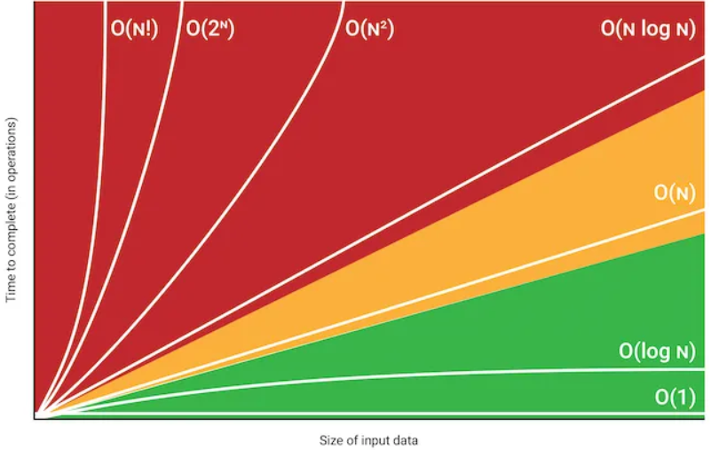

# Big O Notation

**Big O notation** is a mathematical concept used in computer science to
describe the efficiency of an algorithm in terms of time or space complexity.
It provides an upper bound on the growth rate of an algorithm's running time or
space requirements as the input size increases, allowing developers to compare
the performance of different algorithms.

## Purpose

Big O notation is used to classify algorithms according to their worst-case or
upper-bound performance. It helps in understanding how an algorithm's
performance scales with the size of the input data.

## Notation

The notation is written as `O(f(n))`, where `f(n)` describes how the time or
space requirements grow with the input size `n`.

## Common Big O Classes

### `O(1)`

**Constant Time**: The algorithm's performance does not depend on the input
size. An example is accessing an element in an array by index.

### `O(logn)`

**Logarithmic Time**: The performance increases logarithmically as the input
size increases, such as binary search.

### `O(n)`

**Linear Time**: The performance grows linearly with the input size, like
iterating through a list.

### `O(nlogn)`

**Linearithmic Time**: Common in efficient sorting algorithms like mergesort and
heapsort.

### `O(n2)`

**Quadratic Time**: Performance grows quadratically with input size, common in
algorithms with nested loops like bubble sort.

### `O(2n)`

**Exponential Time**: Performance doubles with each additional input
element, such as recursive algorithms solving the Towers of Hanoi problem.

### `O(n!)`

**Factorial Time**: Very inefficient, often found in algorithms that generate
permutations of `n` items.

## Practical Implications

- Big O notation helps in selecting the most efficient algorithm for a given
  problem, particularly when dealing with large datasets.
- It provides a high-level understanding of an algorithm's scalability.

## Limitations

- It focuses on worst-case scenarios and does not always represent average-case
  performance.
- It does not consider constant factors or lower-order terms that
  might affect performance in practical scenarios.

---

## Python Complexities

### Lists `[a, b, c, ...]`

| Operation            | Complexity |
|----------------------|------------|
| `mylist.append(val)` | O(1)       |
| `mylist[i]`          | O(1)       |
| `val in mylist`      | O(N)       |
| `for val in mylist:` | O(N)       |
| `mylist.sort()`      | O(N log N) |

### Dicts `{k:v, ...}`

| Operation            | Complexity |
|----------------------|------------|
| `mydict[key] = val`  | O(1)       |
| `mydict[key]`        | O(1)       |
| `key in mydict`      | O(1)       |
| `for key in mydict:` | O(N)       |

### Sets `{a, b, c, ...}`

| Operation           | Complexity |
|---------------------|------------|
| `myset.add(val)`    | O(1)       |
| `val in myset`      | O(1)       |
| `for val in myset:` | O(N)       |

### Pro-tip:

Replace lists with sets for faster membership checks.

